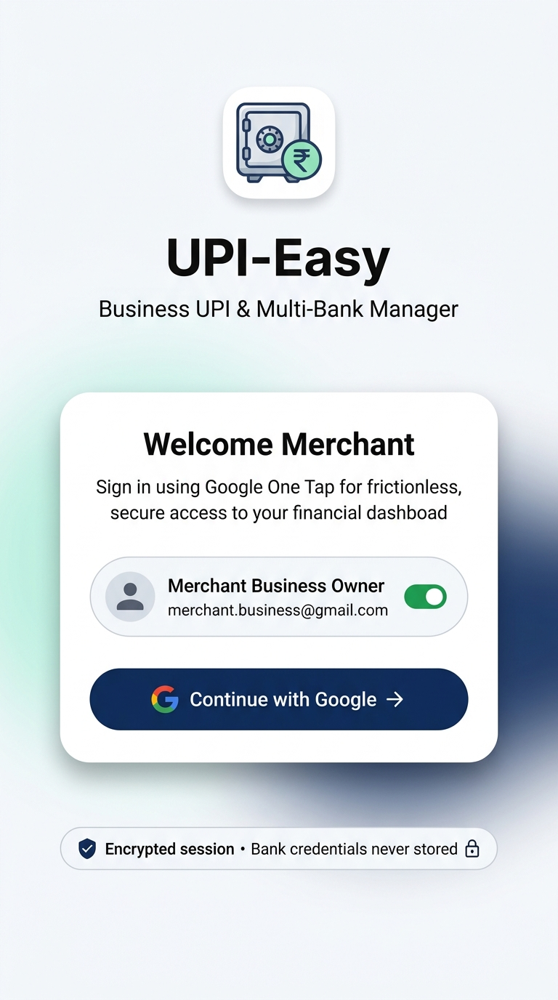
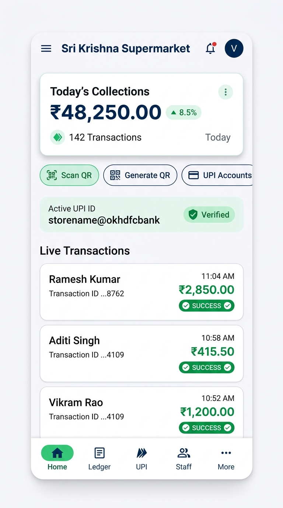
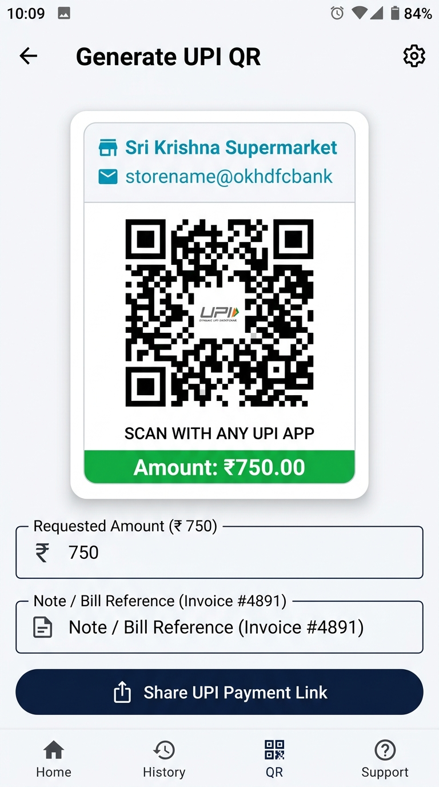
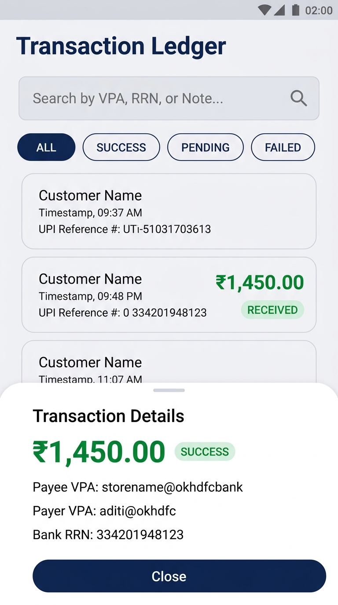

<p align="center">
  
</p>

<h1 align="center">UPI-Easy</h1>

<p align="center">
  <strong>Next-Generation Multi-Bank Business UPI, Dynamic QR Point-of-Sale Terminal & Real-Time Reconciliation Engine</strong>
</p>

<p align="center">
  
  
  
  
  
</p>

---

## 🌟 Overview

**UPI-Easy** empowers retail merchants, supermarkets, restaurants, and SMBs across India to streamline and unify their digital payments. Instead of juggling multiple bank portals and disparate UPI QR stickers, UPI-Easy provides a single unified mobile terminal that connects multiple Virtual Payment Addresses (VPAs), generates instant dynamic billing QRs, and reconciles transactions in real-time with an offline-first architecture.

Whether you operate a single counter or a multi-staff store, UPI-Easy delivers enterprise-grade payment tracking with consumer-grade simplicity.

---

## 📱 Feature Showcase & Application Walkthrough

### 1. Frictionless Merchant Onboarding & Security
Eliminate complex passwords and sensitive credential handling. Merchants sign in securely with **Google One-Tap**, establishing an encrypted session backed by Android Keystore. Bank account credentials and private keys are never stored on device.

<p align="center">
  
  <br />
  <em>One-click merchant sign-in with hardware-backed encryption and zero stored bank credentials.</em>
</p>

---

### 2. Live Command Center & Real-Time Analytics
Monitor the pulse of your business throughout the day. The home dashboard highlights today’s total collections, transaction velocity, percentage growth, and active primary VPA status. Incoming payments stream live with instant visual cues and voice-ready notification triggers.

<p align="center">
  
  <br />
  <em>Real-time revenue metrics, active UPI status badge, quick actions, and streaming live transactions.</em>
</p>

---

### 3. Dynamic POS Billing & Instant QR Generation
Turn any Android phone into an intelligent Point-of-Sale (POS) billing terminal. Enter custom invoice amounts and bill notes to dynamically generate standard NPCI-compliant UPI QR codes (`upi://pay?pa=...`) that work across Google Pay, PhonePe, Paytm, BHIM, and any bank app. Customers can scan directly from the screen, or merchants can share payment links via WhatsApp and SMS.

<p align="center">
  
  <br />
  <em>Instant dynamic QR generation with amount locking, invoice references, and direct link sharing.</em>
</p>

---

### 4. Searchable Transaction Ledger & Bank Audit Trail
Say goodbye to end-of-day reconciliation headaches. The searchable ledger maintains a complete chronological audit trail of all transactions with sub-second filtering by payment status (`SUCCESS`, `PENDING`, `FAILED`), customer name, or Bank Reference Number (RRN). Tapping any record reveals full transaction metadata including fee structures, settlement timelines, and timestamps.

<p align="center">
  
  <br />
  <em>Searchable transaction history with instant status filtering and comprehensive payment breakdown sheets.</em>
</p>

---

### 5. Multi-Bank UPI Routing & Team Management
- **Multi-Bank Accounts**: Link multiple merchant VPAs (e.g. `@okhdfcbank`, `@icici`, `@sbi`) to distribute revenue, switch accounts on the fly, or configure default settlement destinations.
- **Staff Access Control**: Add cashiers, billing clerks, and store managers with role-based access control (RBAC), ensuring team members can view payment alerts and generate QRs without seeing sensitive financial reports.
- **Biometric Security**: Protect store settings and sensitive Upieasyt configurations using device fingerprint or biometric verification.

---

## 🛠️ Technology Stack

| Layer | Technologies |
| :--- | :--- |
| **Mobile Client** | Kotlin 2.0, Jetpack Compose, Material 3, Navigation Compose |
| **Local Persistence** | Room Database (SQLite), DataStore Preferences |
| **Background Sync** | AndroidX WorkManager (Periodic Delta Sync) |
| **Networking** | Retrofit 2, OkHttp 3, Coroutines & Flow |
| **Hardware APIs** | CameraX & Google ML Kit (Barcode/QR Scanning), AndroidX Biometrics |
| **Cloud Backend** | Cloudflare Workers (Edge Serverless), Hono, D1 Database |
| **CI / CD** | GitHub Actions (JDK 17, Gradle 8.9, Automated Release Builds) |

---

## 🚀 Getting Started

### Prerequisites
- Android Studio Ladybug (2024.2+) or later
- JDK 17
- Android device or emulator running Android 8.0+ (API 26+)

### Building the Android App
```bash
# Clone the repository
git clone https://github.com/Shubhjn4357/upi-easy.git
cd upi-easy

# Run unit tests
npm run android:test

# Build the debug APK
npm run android:build

# Build the release bundle
npm run android:bundle
```

Generated APKs are located at:
- `android/app/build/outputs/apk/debug/app-debug.apk`

---

## 📦 Releases & Automated Builds
Every push to the `main` branch automatically triggers GitHub Actions CI/CD to validate and compile the latest build. Releasing a new version via a Git tag (e.g. `v1.0.0`) or GitHub Release automatically attaches the signed APK to the release page for direct download.

---

## 📄 License
This project is licensed under the MIT License - see the [LICENSE](LICENSE) file for details.
